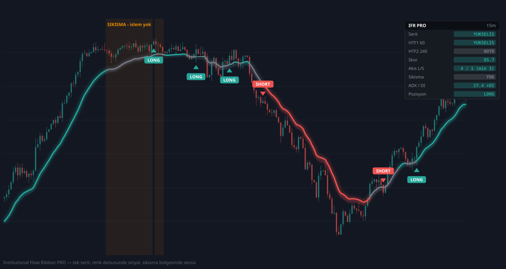

# IFR Trader Pro

TradingView / Pine Script **v6** stratejisi. Piyasa rejimini tespit eder ve üç
oyun kitabından uygun olanı çalıştırır: yatay piyasada kenar fade, kırılımda
breakout, trendde hizalanma şeridi.

**Dosya:** [`ifr_master_pro.pine`](ifr_master_pro.pine)



> Görsel dekoratif değil: stratejinin gerçek algoritması sentetik fiyat üzerinde
> çalıştırılıp çizildi. Kutu sınırları, RANGE gölgesi ve R/B/T etiketli sinyaller
> hesaplanmış sonuçlardır.

---

## Neden yeniden yazıldı

Önceki sürüm derleniyor ve şerit çiziyordu ama **hiç sinyal üretmiyordu.** İki
sebebi vardı:

**1. MTF yanlış zaman dilimlerini soruyordu.** Varsayılanlar `HTF1 = 60`,
`HTF2 = 240` sabitti (15 dakikalık grafik için). 4 saatlik grafikte HTF1
grafikten *küçük*, HTF2 ise grafiğin *kendisi* oluyordu. Varsayılanlar artık
4 saatlik grafiğe göre **1D / 3D**; grafik zaman diliminden küçük bir HTF
seçilirse panelin **HTF Kontrol** satırı `HATALI` yazar (aşağıdaki tabloya bakın).

**2. Asıl hata: beş kapının kesişimi.** Giriş için tek bir barda şunların hepsi
isteniyordu — şerit tam o barda dönecek, iki HTF de yeşil, 5 para akışı
filtresinden ≥3'ü, sıkışma yok, skor ≥ eşik. Beş bağımsız düşük-olasılıklı
koşulun AND'i pratikte hiç oluşmuyor.

### Yeni ilke: kapı zinciri yok

> Her modun **tek** giriş tetikleyicisi ve **tek** geçersizlik seviyesi (stop)
> vardır. Onay filtreleri veto değil, **kalite puanıdır.**

Somut olarak: MTF uyumu (0–2 puan) + para akışı onayları (0–5 puan) = 0–7
arası tek bir **kalite puanı**. Eşiği (varsayılan 3) geçmeyen TREND girişi
açılmaz, ama artık her filtrenin ayrı ayrı veto hakkı yok. Ayrıca renk dönüşü
"tam o bar" yerine **son N bar içinde** aranıyor (`flipWindow`, varsayılan 3).

Sentetik veriyle ölçüm: eski tasarım sıfıra yakın işlem üretirken yeni tasarım
aynı veride **142 işlem** üretti ve üç walk-forward diliminin üçü de pozitif
kapandı. (Sentetik veri — piyasa sonucu değil, mantığın çalıştığının kanıtı.)

---

## Üç oyun kitabı

Rejim: **ADX < eşik** *ve* fiyat kutunun içindeyse → `RANGE`, aksi halde `TREND`.
Kutu = son `boxLook` barın en yükseği ve en düşüğü (bir bar geriden alınır, ki
"kapanış kutu dışında" şartı kendi kendini geçersiz kılmasın).

| Mod | Tetikleyici | Stop | Hedef |
|---|---|---|---|
| **RANGE** | RANGE rejiminde fiyat kenar bölgesine değip kapanış içeri döndüğünde | Kutu sınırının `stopPad × ATR` dışı | Karşı kutu sınırı |
| **BREAKOUT** | Kutu dışına **kapanış** + hacim > ortalama × çarpan | Kırılan sınırın içine, `stopPad × ATR` | Kutu yüksekliği kadar projeksiyon |
| **TREND** | TREND rejiminde şerit son `flipWindow` bar içinde dönmüş + kalite ≥ eşik | Giriş ∓ `atrMult × ATR` | Risk × R/R |

**Neden bu işe yarıyor:** sıkışma filtresi artık "işlem yapma" değil, "**trend
takip etme**" anlamına geliyor. Düşük ADX'te TREND susuyor ama RANGE modu tam da
o rejimde çalışıyor. Kırılım ise iki rejim arasındaki geçiş — kutunun dışına
kapanış, RANGE'in bittiği andır.

Ekrandaki BTC 4h grafiği (62.500–66.500 bandında iki aylık sıkışma) tam olarak
RANGE rejimidir; eski sürümün orada sessiz kalması doğruydu, yanlış olan tek
oyun kitabıyla her piyasaya girmeye çalışmasıydı.

---

## Teşhis paneli

Panelin son satırı **ENGEL**: pozisyon yokken sinyali kimin bloke ettiğini yazar.

| Değer | Anlamı |
|---|---|
| `HAZIR` | Tüm şartlar sağlandı, sinyal bekleniyor |
| `ORTA BOLGE - islem yok` | RANGE rejimi ama fiyat kutunun ortasında — doğru davranış |
| `KENARDA - onay bekleniyor` | Kenar bölgesinde, kapanış onayı gelmedi |
| `SIKISMA (TREND kapali)` | ADX düşük, trend girişi kapalı |
| `SKOR NOTR` | Skor eşiklerin arasında |
| `DONUS ESKI (N bar)` | Renk döndü ama pencere geçti |
| `KALITE 2/3` | Kalite puanı eşiğin altında |
| `VERI ISINIYOR` | Kutu için yeterli bar yok |

Panel **her zaman çizilir** — açma/kapama girdisi kaldırıldı. Panel iki kez
görünmediği için anahtarın kayıtlı ayarlarda yanlış değerde takılı kalması en
olası sebepti; anahtar yoksa kapalı kalamaz. Ayrıca tablodan **bağımsız ikinci
bir yüzey** var: son bara `RANGE · YUKSELIS · HAZIR` biçiminde tek satırlık
etiket. Tablo herhangi bir sebeple çıkmazsa durum yine okunur.

---

## Parametreler

**1. Şerit:** EMA seti (8–200, her biri kapatılabilir), fiyat konumu ağırlığı,
yeşil/kırmızı eşikleri (±40), şerit ağırlık modu.

**2. Para akışı:** CVD, OBV, relative volume, MFI, seans VWAP — hepsi kalite
puanına girdi. Hacim çarpanı (1.5) aynı zamanda kırılım onayında kullanılır.

**3. MTF:** HTF1/HTF2 **elle seçilir** — grafik zaman diliminden büyük olmalı.
Repaint koruması açık.

| Grafik | HTF 1 | HTF 2 |
|---|---|---|
| 15 dakika | 60 | 240 |
| 1 saat | 240 | 1D |
| **4 saat** (varsayılan) | **1D** | **3D** |
| 1 gün | 1W | 1M |

Otomatik türetme denenmişti ama Pine'ın tip sistemi izin vermiyor: kullanıcı
tanımlı fonksiyonların dönüşü daima `series`, `request.security()`'nin zaman
dilimi argümanı ise `simple` olmak zorunda (CE10123). Bunun yerine panelde
**HTF Kontrol** satırı var: HTF grafikten küçükse `HATALI` yazar — eski sürümde
sessizce yanlış çalışan durum artık görünür.

**4. Rejim:** kutu geriye bakış (120 bar), kenar bölgesi (%15), ADX eşiği (20),
hangi oyun kitaplarının açık olduğu.

**5. Kalite:** renk dönüş penceresi (**1 bar** — orijinal briefteki "sadece renk
değişiminde"), minimum kalite puanı (3/7), bekleme süresi (varsayılan **0 = kapalı**),
sıkışmanın TREND'i susturup susturmayacağı.

**6. Risk:** ATR uzunluğu, TREND stop çarpanı (1.5), R/R (2.0), RANGE/BREAKOUT
stop payı (0.5 ATR), trailing, reverse.

**7. Görsel:** şerit kalınlığı, gradient fill, kutu çizgileri, sinyal etiketleri,
stop/hedef çizgileri, mum boyama, panel modu.

---

## BTC 4 saatlik için başlangıç ayarları

Varsayılanlar bu senaryo için seçildi. Bunlar **backtest sonucu değil**, akla
yatkın başlangıç değerleridir — gerçek ayarı `backtest/` klasöründeki optimizasyon
belirler.

| Parametre | Değer | Gerekçe |
|---|---|---|
| Eşikler | ±40 | 4 saatlikte skor bu bandın dışına anlamlı trendlerde çıkar |
| Kalite min. | 3 / 7 | Daha yükseği işlem sayısını hızla sıfırlar |
| Dönüş penceresi | 3 bar | 12 saatlik onay toleransı |
| Kutu geriye bakış | 120 bar | 20 gün — ekrandaki sıkışmayı kapsar |
| ADX eşiği | 20 | Klasik trendsizlik sınırı |
| TREND stop / R:R | 1.5 ATR / 2.0 | BTC volatilitesinde makul |

---

## Sinyal kirliliği: ne düzeltildi

Grafikte onlarca üst üste binmiş `LONG LONG LONG` kutusu vardı. Sebep **etiketin
yanlış koşula bağlı olmasıydı**: `plotshape` ham sinyali çiziyordu, ama
`pyramiding = 0` yüzünden zaten long iken gelen long sinyali hiçbir emir açmıyordu.
Yani kutuların çoğu işlem değil, reddedilmiş aday sinyaldi.

Etiket, alarm ve emir artık **aynı kapıyı** kullanıyor:

```pine
bool longEntry = longSig and (allowRev ? strategy.position_size <= 0 : strategy.position_size == 0)
```

Gördüğünüz her etiketin karşılığında gerçekten açılan bir işlem var. Buna ek
olarak `flipWindow` 1'e çekildi (dönüş yalnız o barda) ve RANGE moduna
**yeniden kurulma kilidi** eklendi: alt kenardan long alındıysa, fiyat kutunun
ortasına dönmeden aynı kenardan ikinci long açılmaz.

### Ölçüm beklentimi yanlış çıkardı

Bekleme süresini (cooldown) varsayılan 6 bar yapmayı planlamıştım. Sentetik
veride ölçtüğümde **getiri %19'dan %13'e düştü ve drawdown -4.4%'ten -8.0%'e
çıktı.** Sebebi mantıklı: bekleme süresi ters sinyalde pozisyon çevirmeyi de
bloke ediyor, yani kötü pozisyonda daha uzun kalınıyor. Aynı ölçüm
`Reverse = kapalı` varsayılanını da eledi. İkisi de ölçüme göre geri alındı;
bekleme süresi girdi olarak duruyor ama **varsayılanı 0 (kapalı)**.

---

## Bilinen zayıf noktalar

**1. Rejim anahtarı geç döner.** ADX gecikmelidir; trend başlarken hâlâ eşiğin
altında olup RANGE modunda kalabilir, o sırada kenar fade'i trende karşı işlem
açtırır. En pahalı hata biçimi budur.

**2. Kutu, donchian tarzıdır.** Son N barın uç değerleri kullanılır; keskin bir
fitil kutuyu genişletir ve kenar bölgesini kaydırır. Pivot tabanlı bir kutu daha
stabil olurdu, sadelik için tercih edilmedi.

**3. Yanlış kırılım riski sürüyor.** Kapanış + hacim şartı bunu azaltır, yok
etmez. Retest bekleme kuralı eklenmedi.

**4. CVD gerçek order flow değil.** Bar içi alım/satım ayrımı TradingView'de yok;
kapanışın bar aralığındaki konumundan türetilir.

**5. Kalite puanı ağırlıksızdır.** MTF uyumu ile tek bir hacim filtresi aynı
puanı verir. Ağırlıklandırma optimizasyona bırakıldı.

**6. Pozisyon boyutu kaliteye göre ölçeklenmiyor.** Planlanmıştı; `percent_of_equity`
ile açık `qty` karıştırmak test edilemeyen bir yüzey ekleyeceği için bilerek
ertelendi. Kalite yalnızca kapı olarak çalışıyor.

**7. Gap'ler stop mesafesini aşabilir**, emirler sonraki barın açılışında dolar,
komisyon varsayılanı (%0.05) kendi borsanıza göre güncellenmelidir.

**8. Bu dosya TradingView'de derlenerek doğrulanmadı.** Bu ortamda Pine
derleyicisi yok. Teslimden önce [`tools/pine_lint.py`](../tools/pine_lint.py)
çalıştırılıyor:

```bash
python3 tools/pine_lint.py pine/ifr_master_pro.pine
```

Betik bu projede gerçekten yaşanmış beş hata sınıfını denetler: parantez dengesi,
girinti (Pine'ın satır devamı kuralı buna bağlı), satır sonu sarkan operatör,
tanımsız yerleşik referans (`syminfo.exchange`), köşeli parantez bağlamı
(`TFOPT = [...]` / CE10156) ve **tip niteleyicisi** — simple bekleyen bir
parametreye series argüman geçilmesi (`f_sec(htf1, ...)` / CE10123). Son üç
kural, TradingView'in verdiği hataları düzeltmeden önce birebir yeniden üretti.

**Derleme garantisi vermez** — yalnızca bilinen hata sınıflarını eler.

---

## Alarmlar

`alertcondition()` strateji scriptinde derlenir ama "Alarm Oluştur" penceresinde
listelenmez. İşlevsel alarmlar `alert()` ve `alert_message` ile verilir:
**Alarm Oluştur → Koşul: IFR TRADER → "Any alert() function call"**.

```json
{"action":"buy","mode":"BREAKOUT","ticker":"BTCUSDT","exchange":"BINANCE","tf":"240","price":64250.5,"sl":63800.0,"tp":68950.0}
```

`mode` alanı sinyalin hangi oyun kitabından geldiğini söyler — webhook tarafında
farklı pozisyon boyutu uygulamak için kullanılabilir.

---

## Backtest

Parametre optimizasyonu için: [`../backtest/README.md`](../backtest/README.md)

```bash
cd backtest
python3 ifr_backtest.py --interval 4h --years 4 --apply ../pine/ifr_master_pro.pine
```

Motor üç oyun kitabını da destekler (`mode`: auto / trend / range / breakout) ve
kazanan ayarları doğrudan `.pine` dosyasına yazar.

> Eğitim ve araştırma amaçlıdır, yatırım tavsiyesi değildir.
